## 1. General 

### Homepage
WheatGRNdb is a free-accessible and user-friendly gene regulatory network database for function gene mining in wheat. It contains 2,622,334 TF-target interactions from integrative network wGRN constructed by unsupervised method. In addition, WheatGRNdb also provides a series of analysis tools for users to discover function genes. We will update the database regularly.

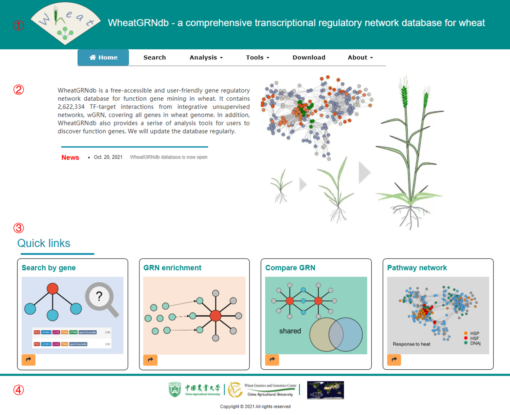

**1.** The logo and modules in database.

**2.** Brief introduction about database.

**3.** Quick links of a few main modules.

**4.** The footer shows the sponsors and website visit statistics.

___

### Unsupervised inference of integrated gene regulatory network

We proposed an unsupervised method to integrate the six different types of networks, including expression-based interactions, TF motif, TF binding, and conserved regulatory network, and one chromatin accessibility score to present an integrative wheat gene regulatory network, `wGRN`. The unsupervised integrative inference for network is suitable for no-model species with little or no training data. Our evaluation results have demonstrated that the wGRN have high predictive power and can recover biologically relevant edges.

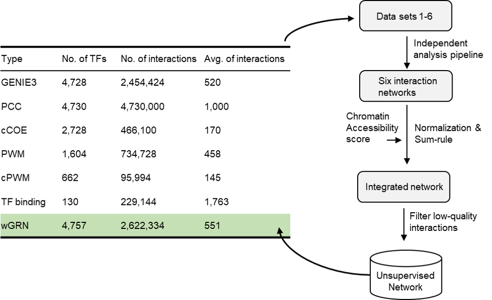

## 2. Search GRN 

In this page, you can obtain comprehensive information of gene of interest. You can share this page by clicking on the button `Share`. In addition, three search methods (left red box), global interactions (both upstream and downstream interactions), upstream regulators, and downstream targets, are supported here. 

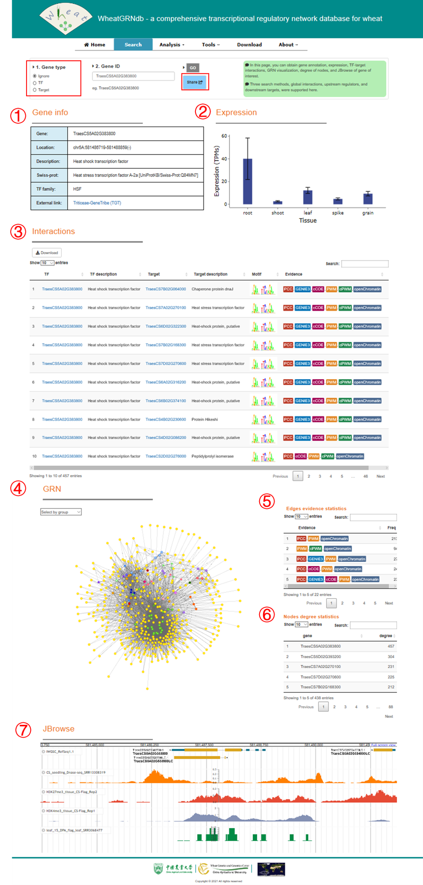

**1.** Gene information including gene ID, gene location, function description, swiss-prot description, TF family, and external link.

**2.** Expression levels of genes across tissues.

**3.** Interactions table containing TF-target interaction relationships. alongside information about function description of genes, TF motif, and feature evidence was provided.

**4.** GRN plot. Colors represent different gene types (TF famililes or target).

**5.** Statistics of interactions supported by diverse features evidence.

**6.** Statistics of degree of nodes in GRN.

**7.** Genome browser JBrowse. Five tracks were showed.

## 3. GRN enrichment 

In this page, You can obtain a set of enriched regulators (TFs) by inputting gene set of interest. All interactions in wGRN are used to perform enrichment analysis. P value to decide the enrichment significance is calculated through hypergeometric distribution. For instance, HSF family could be significantly enriched using a set of differentially expressed genes in response to heat stress.

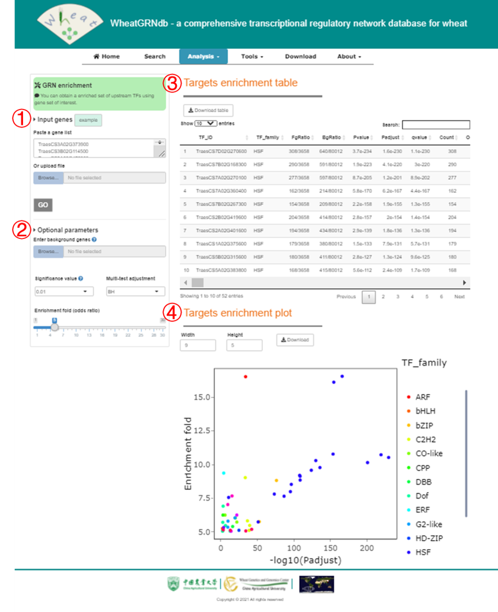

**1.** Gene list of interest.

**2.** Optional parameters including custom background genes, cutoff of significant value and odds ratio, and multi-test method.

**3.** GRN enrichment analysis result. Each row represent a enriched TF.

**4.** Visualization of GRN enrichment. X axis represent -log10(FDR), and Y axis represents enrichment fold (odds ratio). Colors represents TF families. In this instance, HSF family have most significantly enrichment.

## 4. Extract GRN 

In this page, by inputting a gene list, you can obtain all nodes interacting with inputted genes in wGRN.

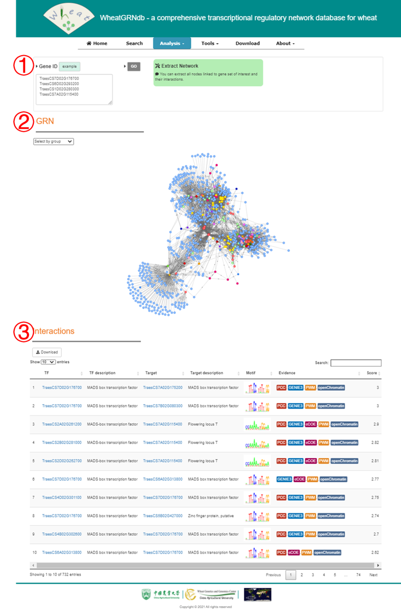

**1.** Gene list of interest.

**2.** GRN plot. Colors represent different gene types (TF famililes or target).

**3.** Interactions table containing TF-target interaction relationships. alongside information about function description of genes, TF motif, and feature evidence was provided.

## 5. Compare GRN 

In this page, you can compare TF-target GRNs in which the two genes are located. Two search methods, upstream regulators and downstream targets, are supported here.

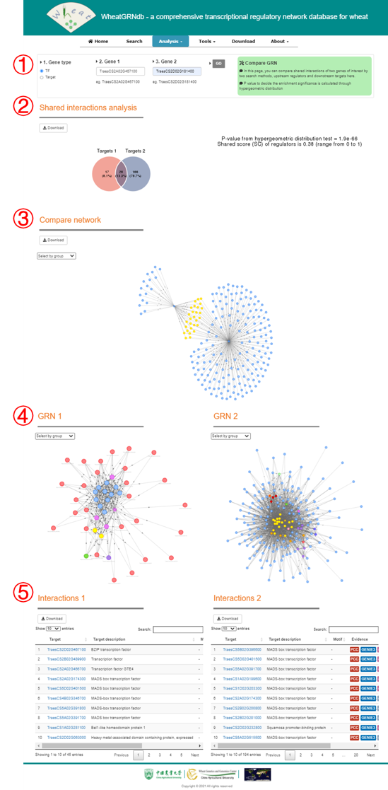

**1.** In this parameter panel, you can select gene type and input gene IDs

**2.** Statistics of shared interactions, P value to decide the enrichment significance is calculated through hypergeometric distribution. Share score is defined as: ( ( # shared genes ) / # targets_1 + ( # shared genes ) / # targets_2 ) / 2.

**3.** GRN plot showing shared intersions.

**4.** Visualization of the respective GRN.

**5.** Interactions table containing TF-target interaction relationships. alongside information about function description of genes, TF motif, and feature evidence was provided.

## 6. Function inference for TF 

In this page, you can obtain function inference of TF based on enriched GO biological precess term of its targets. Only one TF should be inputted. Only terms with less than FDR of 0.05 were considered as significantly enrichment.

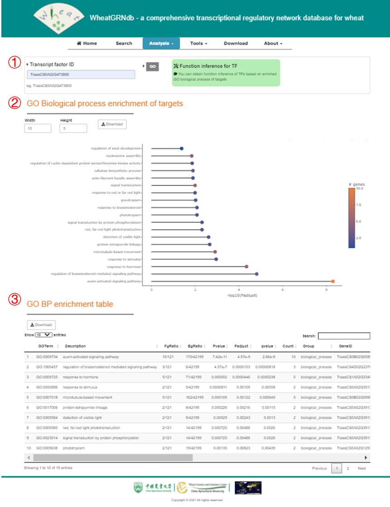

**1.** In this parameter panel, you can input gene IDs.

**2.** Lollipop plot shows enriched GO biological precess. Color represents total number of genes.

**3.** Full table of enriched terms.

## 7. Pathway network 

In this page, You can get the GO biological process (pathway) network you interest. The pathway network is generated from function inference of each TFs and GO annotation.

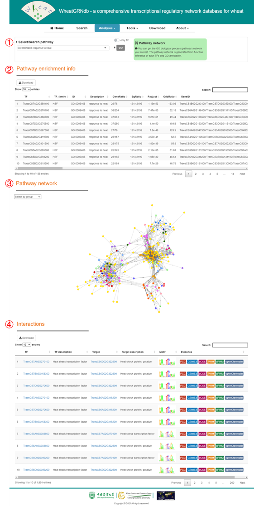

**1.** In this parameter panel, you can select pathway of interest.

**2.** The TFs enriched in the pathway.

**3.** Visualization of the pathway network.

**4.** Interactions table containing TF-target interaction relationships. alongside information about function description of genes, TF motif, and feature evidence was provided.

## 8. Homoeolog traid 

In this page, You can view expression and regulation bias among homoeologs based on pre-inferred triad in wheat.

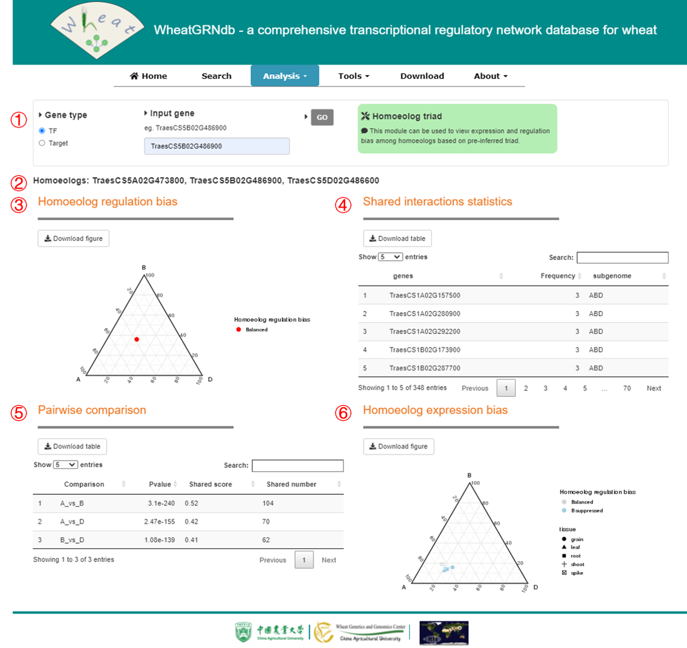

**1.** In this parameter panel, you can select gene type and input gene ID. Pre-inferred triad will be used.

**2.** Gene IDs in homeolog group.

**3.** Regulation bias among homoeologs. The plot shows relative total number of targets/regulators of gene of interest. Only the interactions supported by at least two homoeologs will be used.

**4.** Frequency of supported interactions by different homoeolog groups.

**5.** Pairwise comparsion among targets/regulators of three homoeologs. P value to decide the enrichment significance is calculated through hypergeometric distribution.

**6.** Expression bias among homoeologs.

## 9. Gene browser 

In this page, You can quickly search gene information.

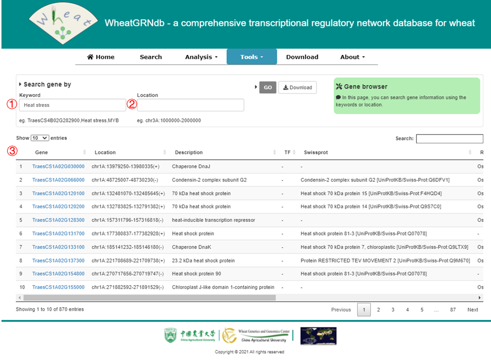

**1.** Search gene information by keyword.

**2.** Search gene information by location.

**3.** Gene information table containing gene ID, location, description, TF family, Swiss-Prot, rice homolog, rice description, Arabidopsis homolog, Arabidopsis description.

## 10. ID conversion 

In this page, you can submit one or more gene IDs to obtain its matched IDs in different annotation versions of wheat cv. Chinese Spring.

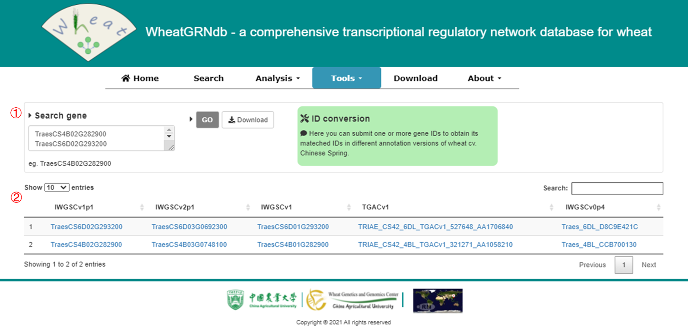

**1.** Input gene IDs.

**2.** Matched gene IDs in different annotation versions of wheat cv. Chinese Spring.

## 11. Expression 

In this page, you can submit one or more gene IDs to view expression patterns of genes in diverse tissues and time-series transcriptome.

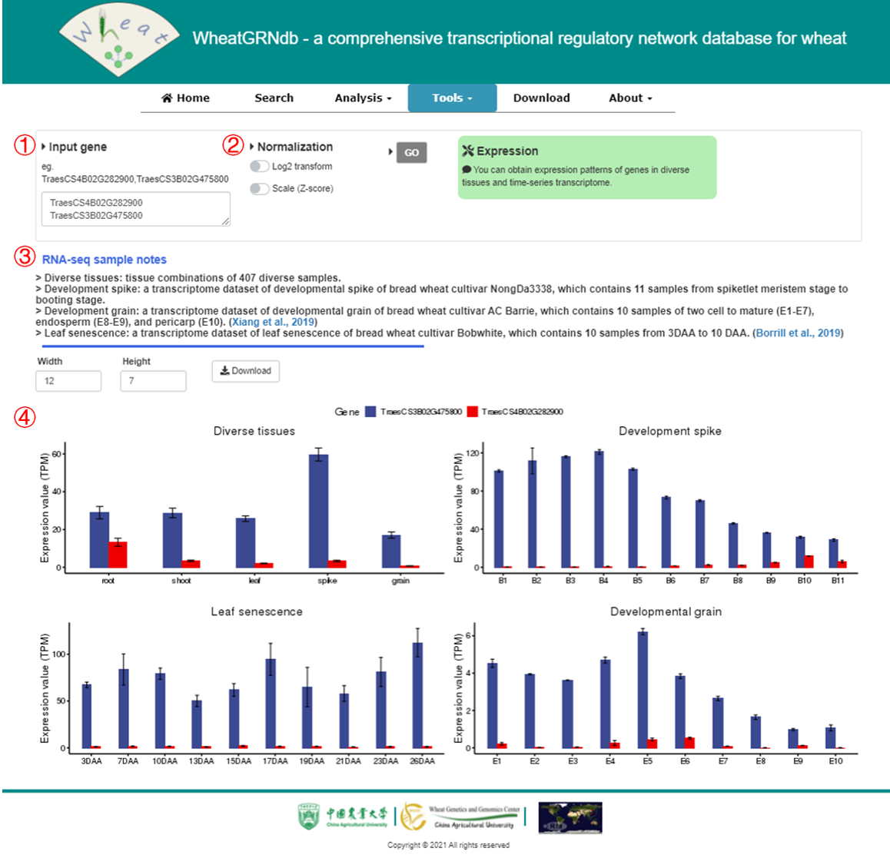

**1.** Input gene IDs.

**2.** Normalization options of expression levels.

**3.** Information and reference of RNA-seq samples.

**4.** Visualization of expression patterns of genes across samples.

## 12. JBrowse 

In this page, you can browse multiomics track of gene and its flanking region.

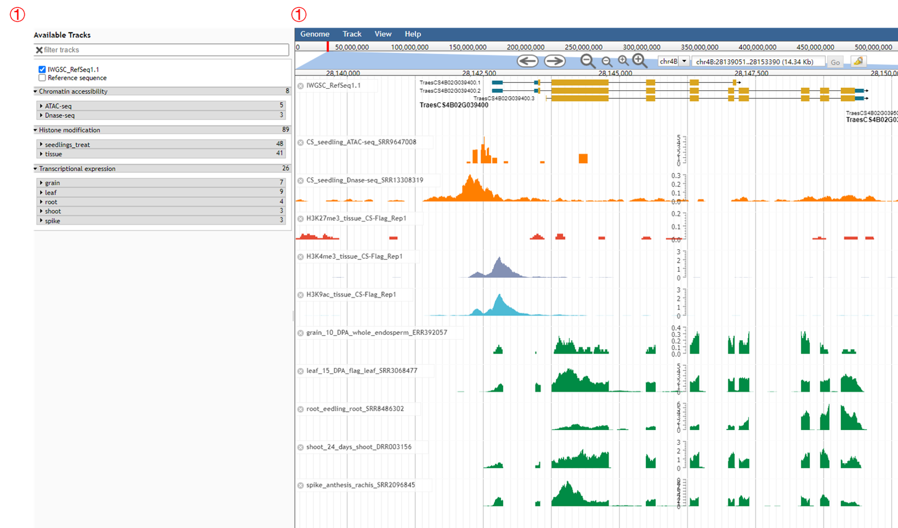

**1.** In the left panel, you can select tracks of interest, including chromatin accessibility (ATAC-seq/DNase-seq), histone modification (H3K27me3, H3K4me3, and H3K9ac ChIP-seq), and expression levels (RNA-seq).

**2.** Right panel shows selected tracks.

## 13. Download 

In this page, you can download all interactions in wGRN and TFs list in wheat.

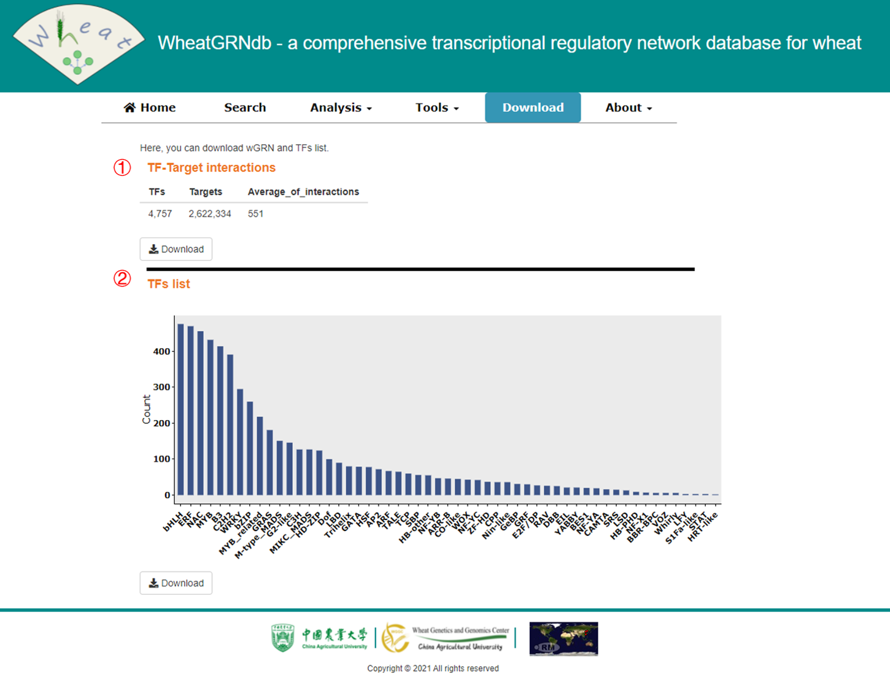

**1.** Statistics of wGRN.

**2.** Statistics of TFs in wheat.

